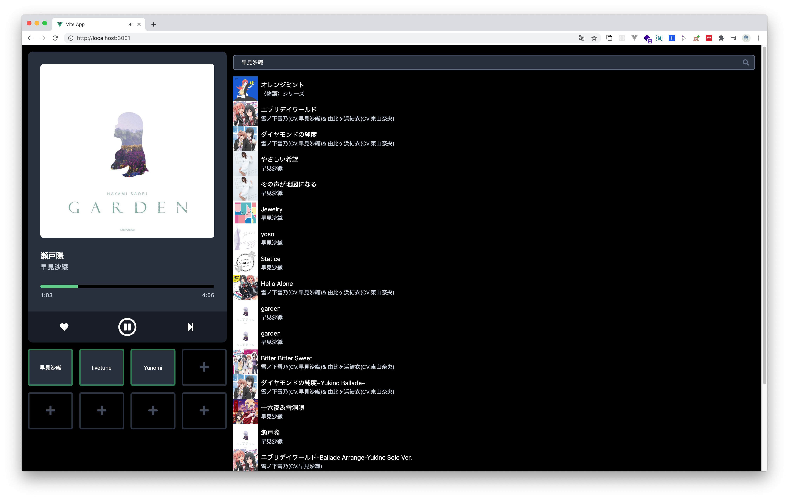
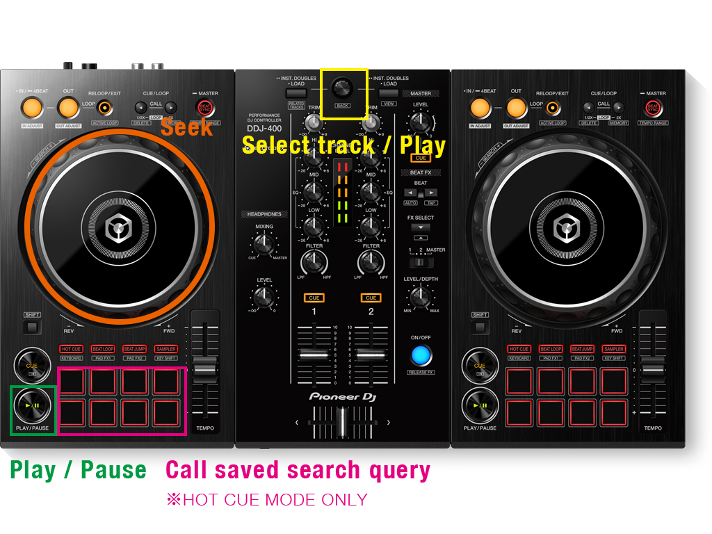

# ReadyToDJ

ReadyToDJ is a Spotify player controllable from DDJ-400. You can enjoy your favorite music using your DJ controller.



## Features

- Play / Pause
- Seek
- Search tracks
- Save favorite search queries

## Getting Started

1. Clone this repository.

2. Set up env file with your access token.
   You can get access token [here](https://developer.spotify.com/documentation/web-playback-sdk/quick-start/).

```
mv .env.sample .env.local
$EDITOR .env.local
```

3. Run dev server

```
yarn install
yarn dev
```

4. Enjoy🎧

⚠️ To play music from DDJ-400, you have to play by clicking button once because of the limitation by web browser.

## How to use



- Product image is imported from [this page](https://www.pioneerdj.com/ja-jp/product/controller/ddj-400/black/overview/).

## License

MIT License
